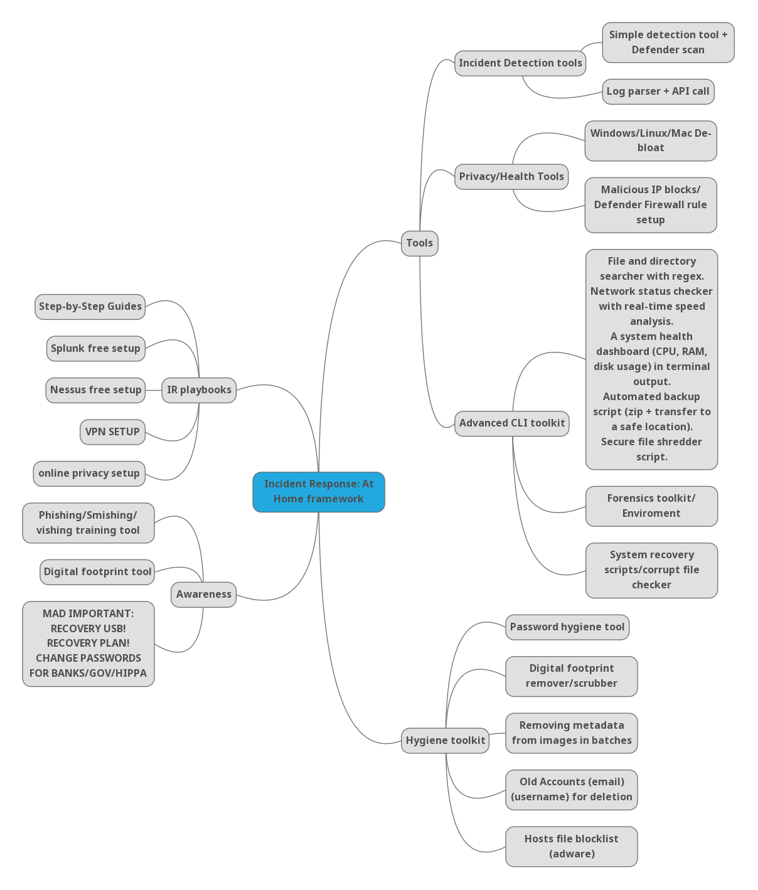

*To be done:*

  
Click to view the mountain of work

  

# At-Home Incident Response Framework 

Welcome to the **At-Home Incident Response Framework**, a comprehensive toolkit designed to help individuals and small organizations detect, respond to, and recover from cybersecurity incidents.

---

## Overview (very liable to change)(initial mapping)

This framework is divided into multiple sections, including:
- **Incident Detection Tools**: Tools to identify potential threats in your system.
-   - ability to check health at a whim
- **Privacy and Health Tools**: Utilities to enhance system privacy and security.
-  - right to privacy and opt out of digital profiling 
- **Advanced CLI Toolkit**: Scripts and tools for automation and system maintenance.
-  - power in your own hands
- **Hygiene Toolkit**: Resources to improve digital hygiene and reduce exposure to risks.
-  - teach others and self triage
- **Awareness and Playbooks**: Guides to increase cybersecurity awareness and respond to common incidents.
-  - guides to follow and grow out of

---

### **Incident Detection Tools**
- `defender-scan.py`: A basic detection tool using Microsoft Defender.
- `log-parser.py`: Parses logs to identify anomalies.
- `api-call-tool.py`: Makes API calls to fetch IP or domain reputation information.

### **Privacy and Health Tools**
- `os-debloat-windows.ps1`: Removes unnecessary bloatware on Windows systems.
- `malicious-ip-blocker.py`: Blocks malicious IP addresses.
- `defender-firewall-setup.ps1`: Configures advanced firewall rules for better security.

### **Advanced CLI Toolkit**
- `file-searcher.py`: Search files and directories using regex.
- `backup-script.py`: Creates automated, secure backups.
- `shredder.py`: Securely deletes sensitive files.
- `health-dashboard.py`: Monitors system health (CPU, RAM, and disk usage).

### **Hygiene Toolkit**
- `metadata-remover.py`: Removes metadata from images and documents.
- `old-account-deleter.py`: Helps locate and delete unused online accounts.
- `hosts-file-blocklist.txt`: Blocks adware and malicious domains.

---

## 🧠 Awareness and Playbooks

### Awareness
- **Phishing Training Tool**: Learn to identify phishing, smishing, and vishing attempts.
- **Digital Footprint Tool**: Visualize your online exposure and minimize risks.
- **Password Hygiene**: Best practices for creating and managing secure passwords.

### Playbooks
- **Phishing/Smishing Response**: Steps to identify and handle phishing attacks.
- **VPN Setup**: Guide to configuring secure VPN connections.
- **Splunk and Nessus Setup**: Tutorials for setting up free versions of Splunk and Nessus for monitoring and vulnerability scanning.

---

## 🔒 Recovery Plan

This framework includes a **critical recovery plan**, detailing:
- **Steps to create a recovery USB** for emergencies.
- **Password recovery processes** for banks, government, or HIPAA-related accounts.
- Guidance on setting up offline backups to restore critical data quickly.

---

## 📦 Examples and Configurations

### Logs
- Example log files (e.g., `syslog-example.log`, `event-log-example.xml`) for testing tools.

### Configurations
- Pre-configured files for Sysmon, Snort, and other tools to simplify setup.

---
